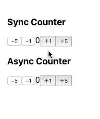

Hooks Async Action Sample
==========



React Redux v7.1 supports Hooks! :tada:

This sample is a PoC for implementing [Async Action Creator](https://redux.js.org/advanced/async-actions#async-action-creators) using Custom Hooks.

### Custom Hooks

The purpose is to hide `dispatch` from components.

```js
// src/asyncactions/counter.js
export const useAsyncActions = () => {
  const dispatch = useDispatch();

  const incrementAsync = useCallback(async (value) => {
    await sleep(500); // dummy networking
    dispatch(increment(value));  
  }, [ dispatch ]);

  const decrementAsync = useCallback(async (value) => {
    await sleep(500); // dummy networking
    dispatch(decrement(value));  
  }, [ dispatch ]);

  return { incrementAsync, decrementAsync };
}
```

### src/components/Counter.js

```js
const AsyncCounter = () => {
  const count = useSelector(state => state.value);
  const { incrementAsync, decrementAsync } = useAsyncActions();

  return (
    <div>
      <h3>Async Counter</h3>
      <button onClick={() => decrementAsync(5)}>−5</button>
      <button onClick={() => decrementAsync(1)}>−1</button>
      {count}
      <button onClick={() => incrementAsync(1)}>＋1</button>
      <button onClick={() => incrementAsync(5)}>＋5</button>
    </div>
  );
}
```
